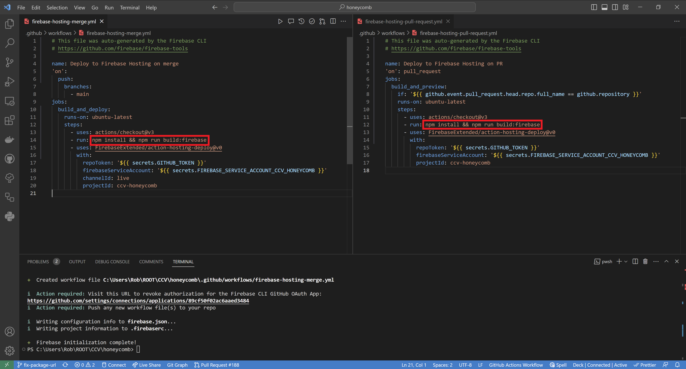

Honeycomb leverages Continuous Integration/Deployment (CI/CD) to build the code and installers for different operating systems and settings on demand or automatically as the code is pushed to the repository. In this section, we provide a short introduction to definitions. We explain the GitHub Actions included with Honeycomb. These workflows should provide a foundation but can easily be modified or extended to meet more needs.

## What is CI/CD?

CI/CD refers to Continuous Integration and either Continuous Delivery or Continuous Deployment. CI/CD enforces the automated building of bundled executables so that tasks can be easily installed without dependencies. In Honeycomb, CI/CD is managed by GitHub Actions.

## What are Github Actions

[GitHub Actions](https://docs.github.com/en/actions) automate tasks within the development life cycle of your software. GitHub Actions consist of a series of commands that run after a specified event has occurred. For example, every time someone creates a pull request for a repository, you can automatically run a command to build and test your software. You can learn more about the events that trigger workflows in [GitHub's documentation](https://docs.github.com/en/actions/reference/events-that-trigger-workflows)

GitHub Actions are written as YML files inside a `.github/workflows/` folder in your repository.

## Building the executables

Honeycomb includes workflows to build and create installers for Windows. Mac and Linux. These workflows exist for two configurations of the tasks:

- Home: The app does not expect event code triggers and photodiode spots.
- Clinic: The app expects event code triggers and photodiode spots.

More specifically, the following workflows are included:

- `build.yaml`: Every time an Pull Request (PR) is opened, or a push is made to the `main` branch, the software is built and tests are run for all platforms and `home` and `clinic` settings. This workflow does not build and upload desktop installers
- `package.yaml`: Create installers for any/all platforms for the `home` and `clinic` setting on demand <sup>1</sup>. The installers/executables are uploaded as artifacts and are available for download from the GitHub Actions tab. This also builds PsiTurk version when linux or all operating systems are selected
- `release.yml`: Every time a Tag is released, installers are created and uploaded as packages. This also builds PsiTurk version, and deploys to GitHub pages a web version of the application.

<sup>1</sup> On-demand workflows are triggered manually from the GitHub Actions tab. Each GitHub organization/individual
has a quota on storage on private repositories. Uploading artifacts counts against your quota. You may
consider configuring your workflows to only upload what you need. You can learn more about GitHub's storage
limits in their [official documentation](https://docs.github.com/en/billing/managing-billing-for-github-actions/about-billing-for-github-actions#about-billing-for-github-actions).

### Download your bundled executable to install and run your task

You can download the executable file from either the tagged release page or the GitHub actions page. To install, unzip the downloaded file, install and run.

The executable does not require installation of any additional software.

### Uninstall the task

#### Windows

Go to System Settings: Add or remove programs. Look for the name of your task in the installed programs list, and Uninstall.

The executable does not require installation of any additional software.

## Firebase Hosting

Automatic deployment on a firebase hosting site can also be setup with github actions. Before proceeding with the following steps, please make sure that firebase is configured by following the [Getting started with firebase section under Set Up Firebase](firebase). Then run the following command in the terminal:

```shell
firebase init hosting:github
```

- Be sure to type "`<username>/<repository name>`" exactly as it appears in GitHub when the prompt "For which GitHub repository would you like to set up a GitHub workflow?" appears.
- When you see the prompt "Set up the workflow to run a build script before every deploy?" enter `y`
- Enter the following command for the prompt "What script should be run before every deploy?":

  ```shell
  npm install && npm run build:firebase
  ```

- When you see the prompt "Set up automatic deployment to your site's live channel when a PR is merged?" enter `y`
- Enter "`main`" for the prompt "What is the name of the GitHub branch associated with your site's live channel?"

There should be two new `.yml` files, `firebase-hosting-pull-request.yml` and `firebase-hosting-merge.yml`, created in the `.github/workflows` directory for a deployment preview for each pull request and the official deployment when merged onto the main branch. Double check that the correct run script is present in both files.


