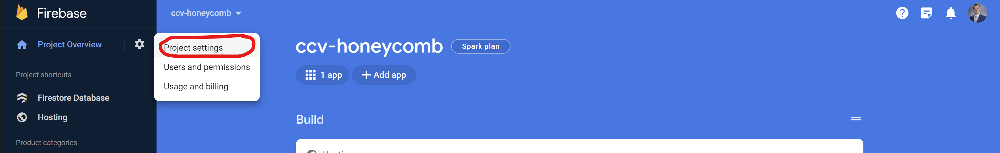
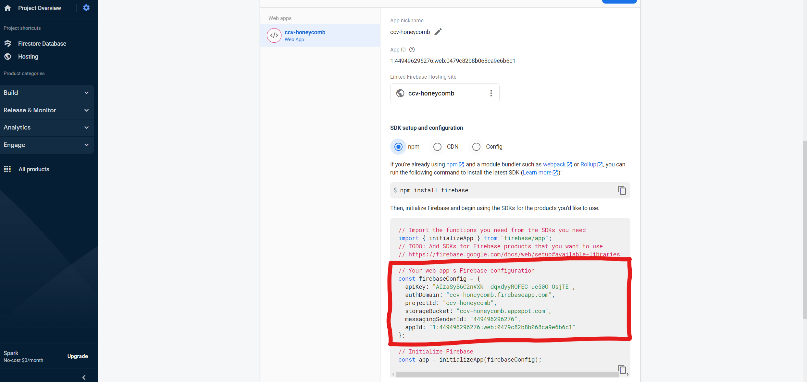
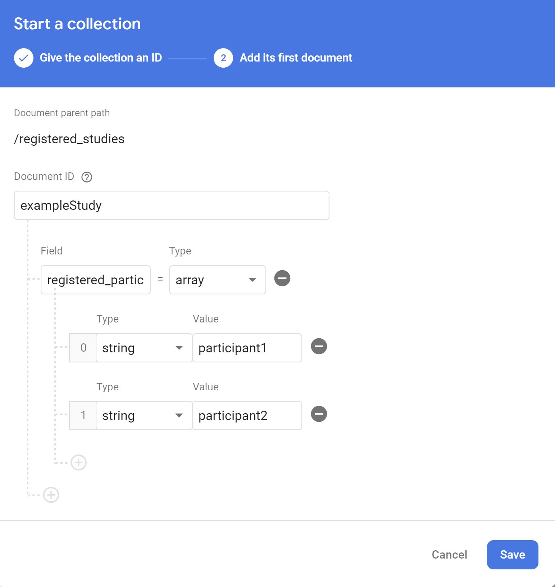
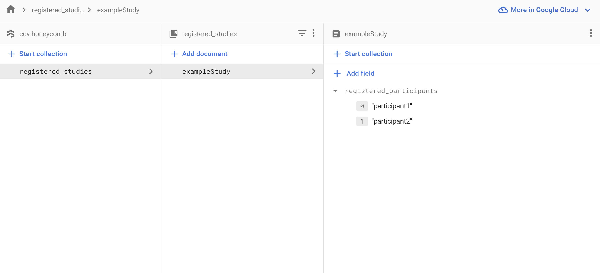

Honeycomb comes with methods and configurations to deploy tasks with [Firebase](https://firebase.google.com/). These tools make it possible to reach a wider audience by hosting your task online.

## Setting up Firebase

:::info
Please have your PI contact [support@ccv.brown.edu](mailto:support@ccv.brown.edu) to create a Firebase project for your Honeycomb task before beginning.
:::

### Adding Products

First we'll configure [Firebase Hosting](https://firebase.google.com/docs/hosting) and [Cloud Firestore](https://firebase.google.com/docs/firestore) on your project.

1. Log in to Firebase with your Google account on the [Firebase console](https://console.firebase.google.com/).
2. Navigate to your project from the console
3. Register a new web app to your project ([Register your app](https://firebase.google.com/docs/web/setup#register-app))

   :::note
   We recommend giving your web app the same name as your task's repository
   :::

4. Add Firestore Database to your project ([Create a Cloud Firestore database](https://firebase.google.com/docs/firestore/quickstart#create))

   :::note
   Chose `production mode` for the starting mode and the default "Cloud Firestore Location"
   :::

The Firebase project is now fully set up! Now we'll connect your task to that project from your computer.

### Installing the Command Line Interface

The Firebase CLI can be installed with the node package manager just like the rest of Honeycomb's dependencies. Be sure to log in with same account you used when logging into the console!

```shell title="Install the Firebase CLI"
npm install -g firebase-tools
```

```shell title="Login to Firebase"
firebase login
```

_A "command not found" error usually indicates `firebase-tools` has not been installed correctly_

### Connecting Your Firebase Project

1. Change the default project name of your task in `.firebaserc`

```json title=".firebaserc" showLineNumbers
{
  "projects": {
    "default": "<your project name>"
  }
}
```

2. Copy the web app credentials from the Firebase console to the corresponding variables in `.env.firebase`

   1. Return to your project on the [Firebase console](https://console.firebase.google.com/).
   2. Navigate to your project setting

      

   3. Scroll down and copy the auto-generated values from the Firebase console to the corresponding variables in the `.env.firebase` file in the `env` folder of your Honeycomb task repo

      

   ```shell title="env/.env.firebase"
   REACT_APP_FIREBASE="true"
   REACT_APP_apiKey=
   REACT_APP_authDomain=
   REACT_APP_projectId=
   REACT_APP_storageBucket=
   REACT_APP_messagingSenderId=
   REACT_APP_appId=
   ```

   _Additional variables may be present in the console, you don't need to copy those._

3. Deploy the default [Firestore Security Rules](https://firebase.google.com/docs/firestore/security/get-started)

```shell title="Deploy Firestore rules"
firebase deploy --only firestore:rules
```

Your task is now connected to an initialized Firebase project!

## Registering Studies

:::caution
This step must be followed _exactly_, otherwise participant will not be allowed to complete the task. See [Security Rules](#security-rules) for more information.
:::

1. Navigate to your Firestore Database in the [console](https://console.firebase.google.com/).
2. Click "Start collection"
3. Enter `registered_studies` for the collection id and click "next"
4. Enter the id of your study for the document id
5. Add a field named `registered_participants` with the type "array"
6. Add the id of each study participant as a string inside the array



The study should like this when you're finished:



### Security Rules

Honeycomb uses security rules to authenticate participants and studies for each task. By default participants must be registered to each study in order to complete the task.

Firestore rules are defined `firestore.rules` file in the home directory. Note the highlighted lines:

```firestore-security-rules title="firestore.rules" showLineNumbers
rules_version = '2';
service cloud.firestore {
  //highlight-start
  match /databases/{database}/documents {
      match /participant_responses/{studyID}/participants/{participantID} {
        allow create, read:
        if participantID in get(/databases/$(database)/documents/registered_studies/$(studyID)).data.registered_participants;
  //highlight-end
        // ...
      }
    }
}
```

Line 3 and 4 indicates that Honeycomb attempts to connect to a document at `/databases/{database}/documents/participant_responses/{studyID}/participants/{participantID}` where `studyID` is a given study and `participantID` is a given participant within that study.

Line 6 defines our rule - it must pass for Honeycomb to connect to the document. `participantID` must be found in an array called `registered_participants` inside of a document at `/databases/{database}/documents/registered_studies/{studyID}`.

Line 5 indicates how Honeycomb can interact with that document. Note that Honeycomb cannot update or delete data! You must manually make these changes from the Firestore console.

:::info
Firestore rules must define every match pattern in your project. Attempting to connect anywhere other than `/participant_responses/{studyID}/participants/{participantID}` will be automatically denied even if you add other collections to your database. This is why `firestore.rules` contains additional nested rules - these should be left alone.
:::

## Developing With Firebase

## Firebase Deployment

## Downloading Data
