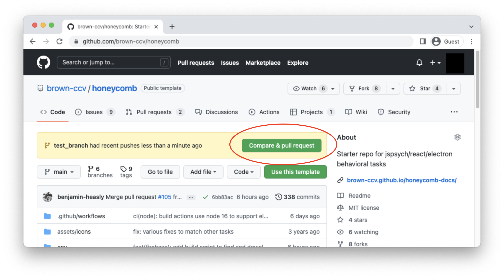
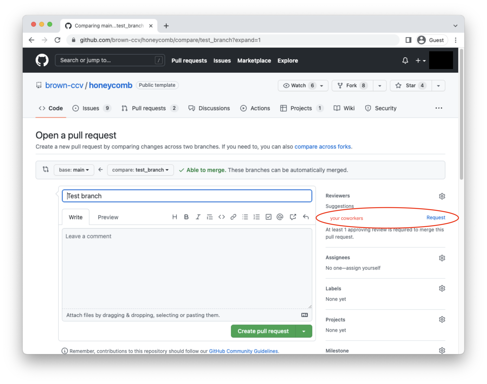

## Git Overview

Git is a version control system that enables you to track changes to files. With Git, you are able to revert files back to previous versions, restore deleted files, remove added files and even track down where a particular line of code was introduced.

Nearly all operations that are performed by Git are in you local computing environment, for the exception of few used purely to synchronize with a remote. Some of the most common git operations are depicted below.


If you would like to make any changes to current repository, it is always good to start with creating a feature branch, where you can save all the changes.


### Comment styles

We encourage using [Commitizen](http://commitizen.github.io/cz-cli/), a great tool for recording descriptions of commits in a standardized format which makes it easier for people to understand what changed in the code.

## Cheatsheet

| Command                       | Brief                                                              |
| :---------------------------- | :----------------------------------------------------------------- |
| git add &lt;files&gt;         | add a file to next commit \(stage\)                                |
| git commit -m &lt;message&gt; | commit staged files                                                |
| git push                      | upload staged commit to repo                                       |
| git pull                      | get remote repo commits and download \(try and resolve conflicts\) |
| git clone &lt;url&gt;         | download entire repository                                         |
| git checkout &lt;branch&gt;   | checkout and create the branch you want to use                     |

```shell
# create branch with your feature
git checkout -b feature_name
# check the status of your repositoey
git status
# commit file contents to the local repository
git commit -am "My feature is ready"
# specific message
# push file contents to the remote (i.e. cloud) repository
git push origin feature_name
```

### Alternative options

Instead of using commands in the terminal, you can also download [GitHub desktop](https://desktop.github.com/). It is very intuitive to use.

#### Clone repository


#### Select a branch or create a new branch


#### Commit changes and push


## Create a Pull Request

Pull requests are useful before you merge your branch with the main branch. You can request a review from your colleagues and check for any conflicts with the main branch. After you pushed all the changes to your branch, you can go to the original GitHub repository and click on the pull request.





## Best Practices

### Git Workflow

We recommend using a simple flow based on following rules:

- Use topic/feature branches, no direct commits on main.
- Perform tests and code reviews before merges into main, not afterwards.
- Every branch starts from main, and targets main.
- Commit messages reflect intent.

#### Git Branches

- `main` is the default branch and where releases are made off. This branch should be in clean/working conditions at all times. This branch is protected and can only be merged from Pull Requests for topic branches
- `topic` branches are created for new features, fixes, or really any changes. E.g, `fix-task-trial2-stuck-button`

This flow is sometimes referred to as [Feature Branch Workflow](https://docs.gitlab.com/ee/gitlab-basics/feature_branch_workflow.html)

## Stay up-to-date with Honeycomb template repo

Honeycomb is an active project, and will be updated with new features over time. To bring changes from the honeycomb template repository to
your task, follow the following steps:

### Add honeycomb as an additional remote

By default, your repository is configured to only sync with your remote, which typically is referred to as `origin`. You can add Honeycomb as an additional remote as follows:

```bash
git remote add honeycomb https://github.com/brown-ccv/honeycomb.git
```

Adding a remote is a one time operation. At that point you can pull content from the `honeycomb` remote as follows:

```bash
git fetch --all
git merge honeycomb/main --allow-unrelated histories
```

If there are any conflicts, you'll need to resolve those, then commit the merge:

```bash
git commit -a -m "merge honeycomb latest"
```
