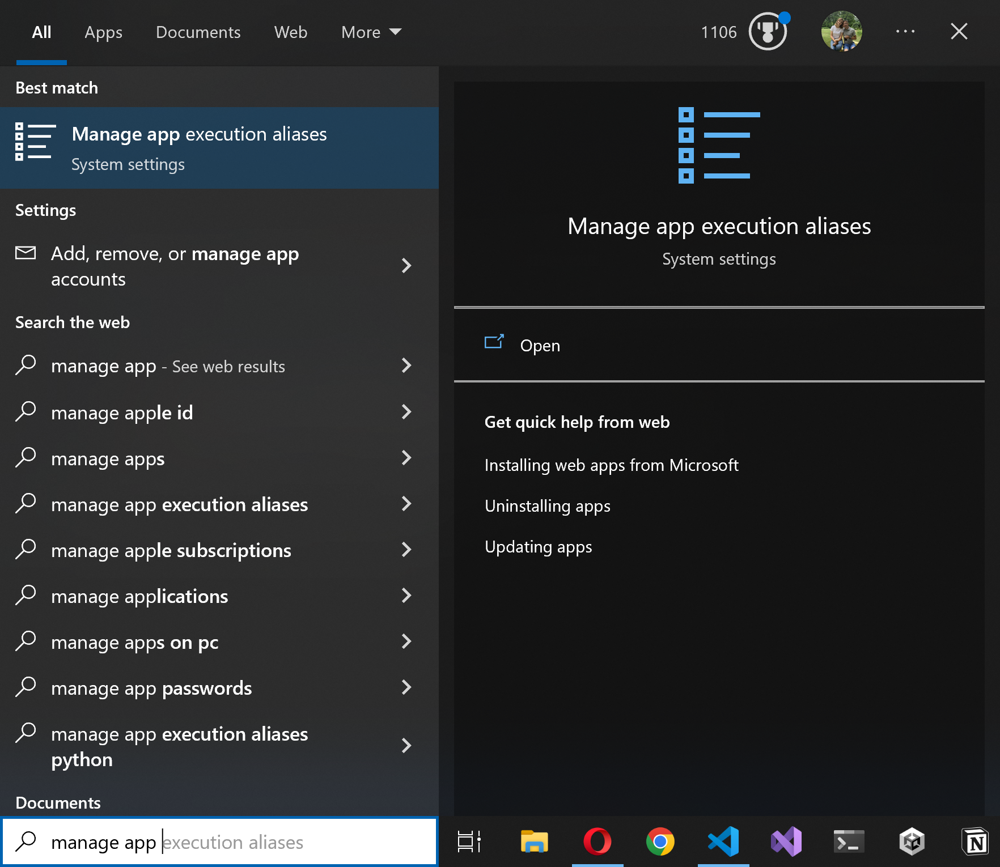
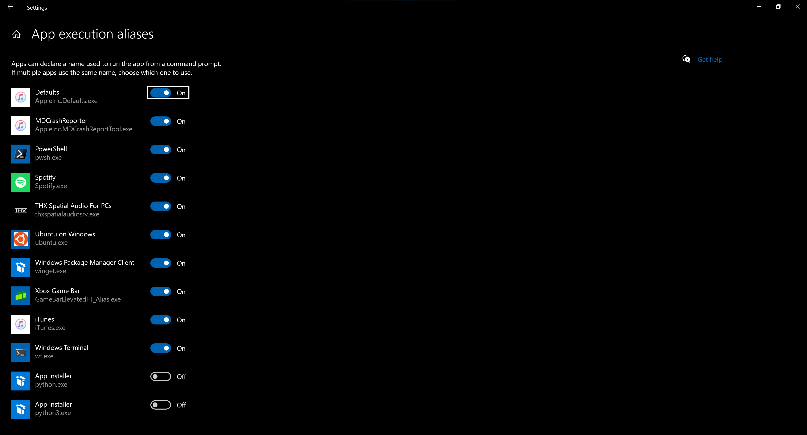

It is important that your computer is set up with the necessary packages before you begin development. You will come across a variety of errors if these prerequisites are not installed. First we need the following programs

- git (version control and GitHub integration)
- nodejs (web development - we recommend the latest long term support version)
- python (3.7 or later)
- An Integrated Development Environment (we recommend VS Code)

In addition, Honeycomb relies on Electron to package the cross-platform desktop applications. Some of electron's prerequisites are platform dependant - listed below are the prerequisites for each operating system along with resources for manually installing them.

## MacOS

### Brew

All of the required dependencies for honeycomb on MacOS can be installed via the brewfile. See the [quick start](quick_start.md/#installing-prerequisites-with-homebrew-for-macos) for more information.

### Manual Installation (MacOS)

- [XCode](https://developer.apple.com/xcode/) must be installed from the terminal:

  ```terminal
    xcode-select --install
  ```

- [Git 2.20.0 or later](https://git-scm.com/downloads/) with support for "--show-current"
- [Node.js](https://nodejs.org/en/download/)
- To install Python (3.7 or later with support for TLS 1.2) follow the guide on electron docs to [install and configure python and its modules](https://www.electronjs.org/docs/development/build-instructions-macos#python)

## Windows

Note that Windows occasionally requires a restart after package installations complete. If you are running into issues after installing the packages please restart your terminal and/or your entire computer. This should resolve most issues.

### chocolatey

#### chocolatey.config

A Chocolatey configuration file looks something like this:

```xml
<?xml version="1.0" encoding="utf-8"?>
<packages>
  <package id="git" />
  <package id="nodejs-lts" />
  <package id="vscode" />
  <package id="pyenv-win" />
  <package id="visualstudio2022community" />
  <package id="visualstudio2022-workload-nativedesktop" />
  <package id="electron" />
</packages>
```

Running `choco install chocolatey.config` is the equivalent of calling `choco install <id>` for every package in the file.

### Python on Windows (pyenv)

Installing and managing Python on Windows is a notoriously difficult task even for advanced developers. It is best practice to have exactly 1 tool for managing python on your system, which is a rule for most things in software development (this is what [npm](quick_start.md/#3-install-npm-packages) does for node packages). **We highly recommend uninstalling Python and using pyenv even if you never anticipate using python again.** We promise the extra setup today will pay great dividends in the future!

First and foremost, turn off both Python App Installers in the "App Execution Aliases" settings. **Please complete this step even if you already have a Python manager**




Now we can set up our python management system<sup>1</sup>. We recommend [pyenv](https://github.com/pyenv-win/pyenv-win) as it is small and intuitive for newer developers. It lets us install python globally AND switch between different versions for individual projects. It does this (and only this) extremely well. Complete the following steps to install `pyenv` for Windows and set up your global python environment:

1. Ensure Python is completely uninstalled from your system<sup>2</sup>

   - Type `python` on the command line and ensure you get a "Command 'python' not found" error

     ```powershell
     python
     ```

   - _If the command executes, locate the installation (check "Add or Remove programs" in the settings) and remove it. Continue until the error appears_
   - _If the Microsoft Store launches check again to ensure "Manage App execution aliases" is turned off for `python.exe` and `python3.exe`_

2. Install `pyenv-win`

   - `pyenv-win` will install with `chocolatey.config` - enter `pyenv` on the command line to see if it's already on your system. You should see a list of commands printed to your terminal.

     ```shell
     pyenv
     ```

   - If not:

     ```shell
     choco install pyenv-win
     ```

3. Install your python version

   ```powershell
   pyenv install <version>
   ```

   - If you're using a different Python version for another project that version will work fine so long as it is at least version `> 3.0.0`
   - Otherwise install the newest version that includes exactly 3 numbers, e.g. `3.10.6`

     ```powershell
     pyenv install --list
     ```

4. Use that version as your global install

   ```powershell
   pyenv global <version>
   ```

<sup>1</sup>_If you are already using [Anaconda](https://www.anaconda.com) for Python and it's
various other tools that is okay! You already have python manager installed on your system and can
skip this section._

<sup>2</sup>_Any "solo" installations can and will cause major conflicts with `pyenv`. It can cause
issues when you try to change your version, when another program checks for python, when you update
Windows... so on and so forth. Perhaps you've already run into something unexpected like this! This
is why it's essential python is completely uninstalled from your computer before beginning._

### Manual Installation (Windows)

- [Git](https://git-scm.com/download/win)
- [Node.js](https://nodejs.org/en/download/)
  - We recommend installing the "LTS" option for better stability
- [VS Code](https://code.visualstudio.com/download)
- Visual Studio:
  - [Visual Studio 2022 Community](https://visualstudio.microsoft.com/vs/community/)
  - Install the [Native C++ Workflow](https://docs.microsoft.com/en-us/cpp/build/vscpp-step-0-installation?view=msvc-160#step-4---choose-workloads-1)
- [pyenv for Windows](https://github.com/pyenv-win/pyenv-win#installation)

## Linux

We recommend using Ubuntu (18.10 or later) as your distro but any distro new enough to support GLIBC_2.28 should work.

- Download the [Node.js source code](https://nodejs.org/en/download/) and compile it
- [Git 2.20.0 or later](https://git-scm.com/downloads/) with support for "--show-current"
- [Python 3.7 or later](https://www.python.org/downloads/) (with support for TLS 1.2)
- Install [Clang](https://clang.llvm.org/get_started.html) or follow installation instructions on the [electron docs](https://www.electronjs.org/docs/development/build-instructions-linux#prerequisites)
- Development headers of `GTK 3` and `libnotify` (Follow installation instructions on the [electron docs](https://www.electronjs.org/docs/development/build-instructions-linux#prerequisites))

## Further Help

If you are still having issues setting up your computer you can find the full instructions on the [electron documentation](https://www.electronjs.org/docs/development/build-instructions-gn) for your specific OS.
