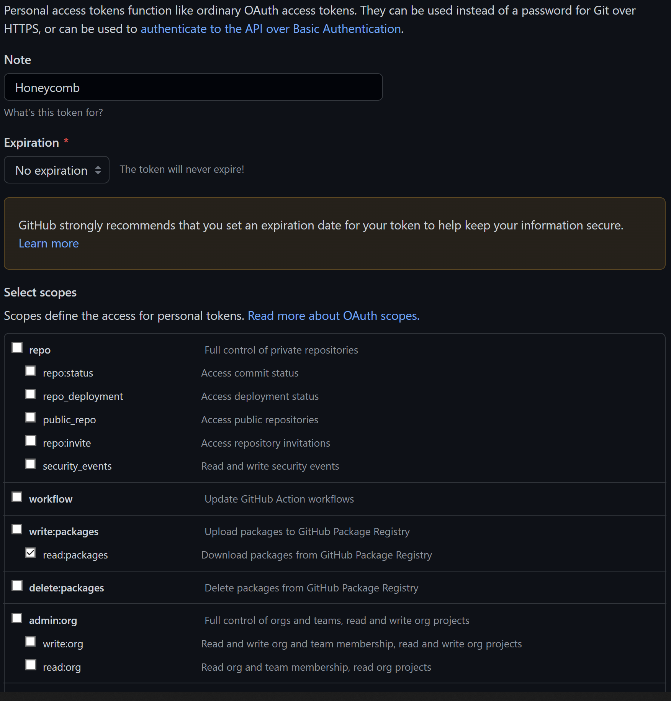
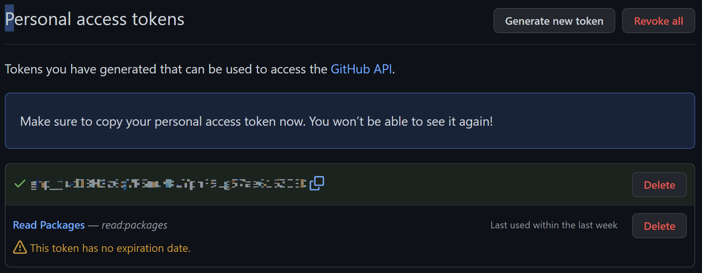

To start a new task locally, in development mode follow these steps:

### 1. Start your new task from our template repository

The simplest way to get started is creating a new repository using Honeycomb as a template.

Go to https://github.com/brown-ccv/honeycomb and click on `Use this template` on the top right. Then select the organization and the name of your repository and click on `create repository from template`

Alternatively, you can use GitHub CLI to create a new project based on the Honeycomb template repository. First, install GitHub CLI (https://cli.github.com/), then simply run on your terminal:

```
gh repo create your-new-task-name --template brown-ccv/honeycomb
``` 

You can now move into the directory that was just created

```
cd your-new-task-name
```

### 2. Change name and description

It's best practice to create a new branch whenever we look to make changes and/or add a new feature. Your IDE may have a way to do this or it can always be done on the command line.

```
git checkout -b <branch-name>
```

Open `package.json` and edit it to reflect your app name and description (e.g. `name`, `author`, `repository`). Save your changes and commit them to git:

```
git commit -m "Commit message goes here!"
```

*Checkout the [Version Control](https://brown-ccv.github.io/honeycomb-docs/docs/version_control) page for more information about working with git*

### 3. Install Electron dependencies

Honeycomb relies on Electron to package the cross-platform desktop applications. Before starting, you will need to install Electron's pre-requisites below. You can find the full instructions on the [electron documentation](https://www.electronjs.org/docs/development/build-instructions-gn) for your specific OS.

#### Windows

- Visual Studio:
Install the latest version of [Visual Studio](https://visualstudio.microsoft.com/downloads/) with the Desktop Development for C++ Workflow. 
To add the workflow, follow [these instructions](https://docs.microsoft.com/en-us/cpp/build/vscpp-step-0-installation?view=msvc-160#:~:text=If%20you%20have%20Visual%20Studio,Then%2C%20choose%20Modify).

- Node.js:
Install [Node.js](https://nodejs.org/en/download/)

- Git bash (Git 2.20.0 or later with support for "--show-current"):
Install [git bash](https://git-scm.com/downloads)

**Note: restart computer after all installs are complete**

#### MacOS

- Command Line Tools: Type in the terminal

    ```
    xcode-select --install
    ```

- Node.js:
Install [Node.js](https://nodejs.org/en/download/)

- Git 2.20.0 or later (with support for "--show-current"):
Install [git](https://git-scm.com/downloads/)

- Python 3.7 or later (with support for TLS 1.2):
Follow the guide on electron docs to [install and configure python and its modules](https://www.electronjs.org/docs/development/build-instructions-macos#python) 

#### Linux

- Node.js:
Dowload [Node.js source code](https://nodejs.org/en/download/) and compile it: 

- Git 2.20.0 or later (with support for "--show-current"):
Install [git](https://git-scm.com/downloads/)

- Python 3.7 or later (with support for TLS 1.2):
Install [Python](https://www.python.org/downloads/)

- Clang:
Install [Clang](https://clang.llvm.org/get_started.html) or follow installation instructions on the [electron docs](https://www.electronjs.org/docs/development/build-instructions-linux#prerequisites)

- Development headers of GTK 3 and libnotify:
Follow installation instructions on the [electron docs](https://www.electronjs.org/docs/development/build-instructions-linux#prerequisites)

**Note: Ubuntu 18.10 or later recommended (or another distro new enough to support GLIBC_2.28)**

### 4. Add Your Personal Access Token

Honeycomb depends on certain packages only present in GitHub's own package manager. In order to install the packages you generate a personal access token on your GitHub account:

- Create a new branch
- Open the `.npmrc` file in `your-new-task-name` and add the following line:

    ```
    //npm.pkg.github.com/:_authToken=
    ```

- Log in to [GitHub](https://github.com) on the web
- Navigate to Settings -> Developer Settings -> Personal Access Tokens
- Click "Generate a new token", add a note, set `Expiration` to "No expiration" and select `read:packages`

    

- Click "Generate Token" and copy the token. *The token will be lost forever after you exit the page!*

    

- Paste the code after the = from before and save. It should look as such:

    ```
    //npm.pkg.github.com/:_authToken=ghp_abcde12345
    ```

`.npmrc` now contains a secret key, we must tell git to stop tracking it.

- Add ".npmrc" to the end of the `.gitignore` file
- Remove the file from git:

    ```
    git rm --cached .npmrc
    ```

Everything is now prepared to install the dependencies for Honeycomb! Run:

    ```
    npm install
    ```

### 5. Run the task in dev mode

*Windows users must use a git bash terminal*

```
npm run dev
```

This will launch an electron window with the task and inspector open. It will hot-reload whenever changes are made to the app.

### 6. Run the task with preset environment variables

We have provided various `.env` files and npm scripts to run the task in common settings like home or clinic. Here are the possible commands:
```
npm run dev:home
```
```
npm run dev:home:video
```
```
npm run dev:clinic
```
```
npm run dev:clinic:video
```
```
npm run dev:firebase
```

### 7. Check out the data

The data is saved throughout the task to the users's app directory.  This is logged at the beginning of the task wherever you ran `npm run dev`. It is also stored in a folder that is generated by the app, which should be found on the desktop.

### 8. Quit the task

If you want to quit in the middle of the task, you can use these keyboard shortcuts:
```
Ctrl+W (for PC/Windows)
```
```
Cmd+Q (for Mac)
```
Partial data will be saved.

### 9. Merge updates from Honeycomb template repo

Honeycomb is an active project, and will be updated with new features over time. To merge the honeycomb template repository updates with your task, follow the following steps:
First time only:
```
git remote add honeycomb https://github.com/brown-ccv/honeycomb.git
```
Every time: 
```
git fetch --all
```
```
git merge honeycomb/main --allow-unrelated histories
```
If there are any conflicts:
```
git stash
```
To merge:
```
git commit -a -m "merge honeycomb latest"
```

### 10. Run automated tests

When getting started, merging updates, or making custom changes, it's a good idea to run automated tests.  These can tell you if things are working or if recent changes broke something that previously worked.

To run the tests interactively:
```
npm test
```

Or non-interactively:
```
CI=true npm test
```

#### Linux
When running `npm test` on Linux, you might get an error that mentions `ENOSPC`.  This is because the test runer creates "watchers" for files in the project repo in order to automatically re-run tests as the files change.  Linux limits the number of watchers that can be created at a time and the default limit may be smaller than the number of files in the repo.

This is a "known issue" with some test runners on Linux, as in discussions [here](https://stackoverflow.com/questions/55763428/react-native-error-enospc-system-limit-for-number-of-file-watchers-reached) and [here](https://stackoverflow.com/questions/62206460/jest-watch-error-enospc-system-limit-for-number-of-file-watchers-reached).

One simple workaround is to increase the number of allowed watchers (100000 seems to be sufficient):
 - Command that initially fails with `ENOSPC`: `npm test`
 - Check the configured limit on "watchers": `cat /proc/sys/fs/inotify/max_user_watches`
 - Edit the relevant Linux config file: `sudo vim /etc/sysctl.conf`
 - Add a line at the end of the config file: `fs.inotify.max_user_watches=100000`
 - Save, exit, and reload the config file: `sudo sysctl -p`
 - Check that the limit has changed: `cat /proc/sys/fs/inotify/max_user_watches`
 - Retry the initial command, which should now succeed: `npm test`
