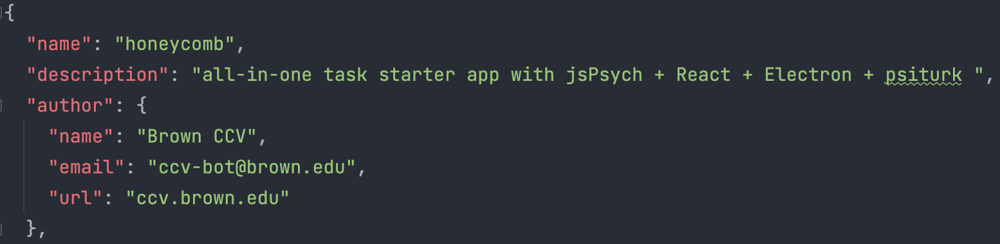
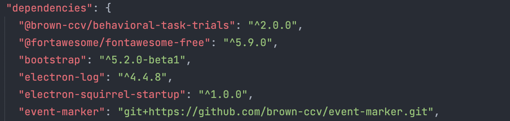
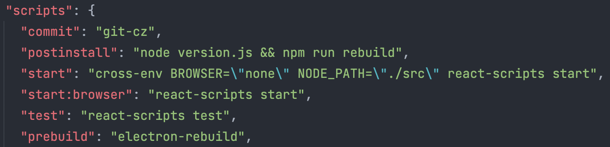

Before we can get started with Honeycomb, we must make sure our machines have the required prerequisites for Honeycomb to run. 
### 0. Installing Prerequisites
There are some prerequisites that are required across all operating systems to run Honeycomb. For macOS users, we highly recommend using Homebrew to expedite installing these prerequisites.

The following are required for this project: 
1. git
2. Node.js
3. Electron
4. Firebase CLI


#### Installing Prerequisites with Homebrew (for macOS)
##### Installing Homebrew 
Paste the following in a macOS Terminal and press enter to install Homebrew. 

  
    /bin/bash -c "$(curl -fsSL https://raw.githubusercontent.com/Homebrew/install/HEAD/install.sh)"
 
Note: *When this command is run, additional installations may be automatically added by Homebrew based on your machine's configurations.*

##### Running Brewfile 
A Brewfile is a script that developers can use to install multiple software tools that are required to run an application. 

In the project directory, locate the file named `Brewfile` and on the command line, run the following command:
    
    brew bundle
    
This will call the `brew` command on each package listed, effectively downloading and installing all of the desired prerequisites to your project. 


### 1. Start your new task from our template repository
To start a new task locally, in development mode follow these steps:

The simplest way to get started is creating a new repository using Honeycomb as a template.

Go to https://github.com/brown-ccv/honeycomb and click on `Use this template` on the top right. Then select the organization and the name of your repository and click on `create repository from template`

Alternatively, you can use GitHub CLI to create a new project based on the Honeycomb template repository. First, install GitHub CLI (https://cli.github.com/), then simply run on your terminal:

```
gh repo create your-new-task-name --template brown-ccv/honeycomb
``` 

You can now move into the directory that was just created

```
cd your-new-task-name
```

### 2. Change name and description

It's best practice to create a new branch whenever we look to make changes and/or add a new feature. Your IDE may have a way to do this or it can always be done on the command line.

```
git checkout -b <branch-name>
```

Open `package.json` and edit it to reflect your app name and description (e.g. `name`, `author`, `repository`). Save your changes and commit them to git:

```
git commit -m "Commit message goes here!"
```

*Checkout the [Version Control](https://brown-ccv.github.io/honeycomb-docs/docs/version_control) page for more information about working with git*


### 3. Install NPM Packages
With Node.js installed in Step 0, we are now able to utilize the `npm` command in the terminal. 

npm is a command-line utility for Node.js that makes it easy for you to install packages and maintain them throughout the lifecycle of your application. 

Honeycomb, like most applications, contains a template called `package.json`. This file contains three distinctive parts that we interact with using a series of npm commands.


##### 1. Metadata

The metadata provides information about the project such as the name, author and description. 

##### 2. Dependencies


Dependencies are packages that the project rely on for it to function properly. 

They are formatted in specific key/value pairs where every key is a name of the package and the value is the version range that’s acceptable.

Please run the following command to trigger the installation of all the dependencies listed in the `package.json`.

    npm install

Note: *If any changes are made to the dependencies section of the `package.json`, you must run `npm install` again to download the newly updated list of dependencies.*


##### 3. Scripts


The scripts section contains a number of commands you can run.

They are also presented in key/value pair where the key is the command name and value is the command we want to run. 


### 4. Run the task in dev mode

*Windows users must use a git bash terminal*

```
npm run dev
```

This will launch an electron window with the task and inspector open. It will hot-reload whenever changes are made to the app.

### 5. Run the task with preset environment variables

We have provided various `.env` files and npm scripts to run the task in common settings like home or clinic. Here are the possible commands:
```
npm run dev:home
```
```
npm run dev:home:video
```
```
npm run dev:clinic
```
```
npm run dev:clinic:video
```
```
npm run dev:firebase
```

### 6. Check out the data

The data is saved throughout the task to the users's app directory.  This is logged at the beginning of the task wherever you ran `npm run dev`. It is also stored in a folder that is generated by the app, which should be found on the desktop.

### 7. Quit the task

If you want to quit in the middle of the task, you can use these keyboard shortcuts:
```
Ctrl+W (for PC/Windows)
```
```
Cmd+Q (for Mac)
```
Partial data will be saved.

### 8. Merge updates from Honeycomb template repo

Honeycomb is an active project, and will be updated with new features over time. To merge the honeycomb template repository updates with your task, follow the following steps:
First time only:
```
git remote add honeycomb https://github.com/brown-ccv/honeycomb.git
```
Every time: 
```
git fetch --all
```
```
git merge honeycomb/main --allow-unrelated histories
```
If there are any conflicts:
```
git stash
```
To merge:
```
git commit -a -m "merge honeycomb latest"
```

### 9. Run automated tests

When getting started, merging updates, or making custom changes, it's a good idea to run automated tests.  These can tell you if things are working or if recent changes broke something that previously worked.

To run the tests interactively:
```
npm test
```

Or non-interactively:
```
CI=true npm test
```

#### Linux
When running `npm test` on Linux, you might get an error that mentions `ENOSPC`.  This is because the test runer creates "watchers" for files in the project repo in order to automatically re-run tests as the files change.  Linux limits the number of watchers that can be created at a time and the default limit may be smaller than the number of files in the repo.

This is a "known issue" with some test runners on Linux, as in discussions [here](https://stackoverflow.com/questions/55763428/react-native-error-enospc-system-limit-for-number-of-file-watchers-reached) and [here](https://stackoverflow.com/questions/62206460/jest-watch-error-enospc-system-limit-for-number-of-file-watchers-reached).

One simple workaround is to increase the number of allowed watchers (100000 seems to be sufficient):
 - Command that initially fails with `ENOSPC`: `npm test`
 - Check the configured limit on "watchers": `cat /proc/sys/fs/inotify/max_user_watches`
 - Edit the relevant Linux config file: `sudo vim /etc/sysctl.conf`
 - Add a line at the end of the config file: `fs.inotify.max_user_watches=100000`
 - Save, exit, and reload the config file: `sudo sysctl -p`
 - Check that the limit has changed: `cat /proc/sys/fs/inotify/max_user_watches`
 - Retry the initial command, which should now succeed: `npm test`
