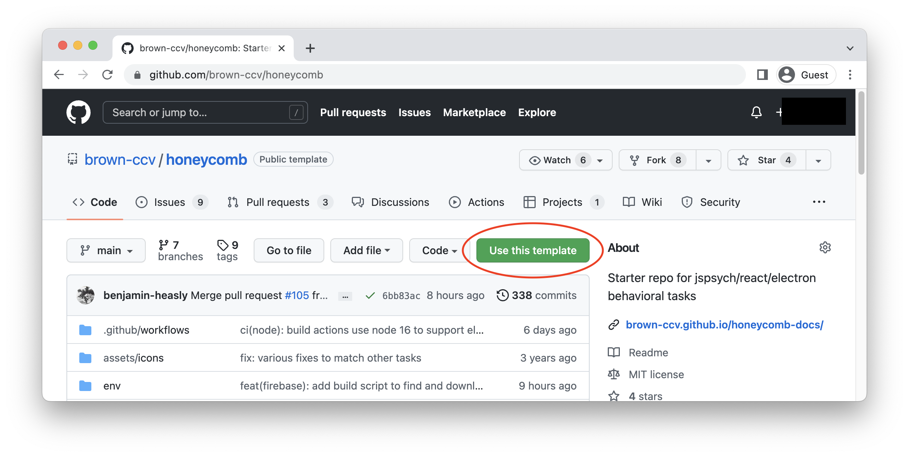
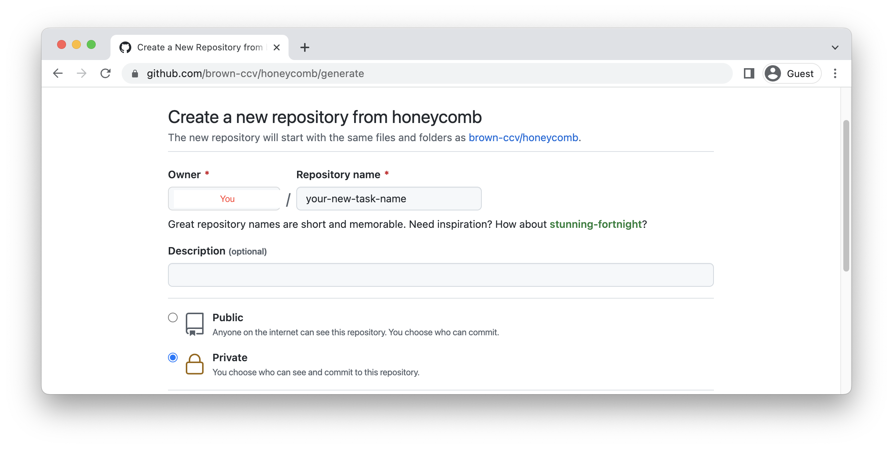
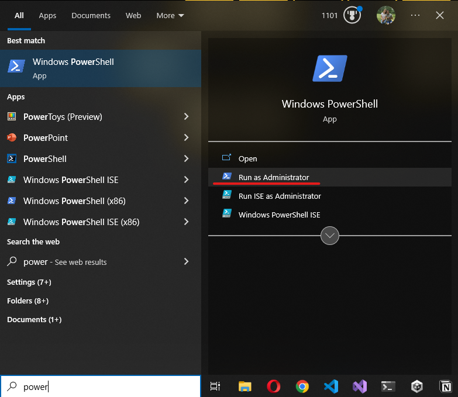

import Tabs from '@theme/Tabs';
import TabItem from '@theme/TabItem';
import cloneCodeButton from './assets/clone-code-button.webp';

## Creating Your Task Repository

The Honeycomb repository is a template and serves as the starting point for all tasks. Creating your repository from the template starts your project with the same directory structure and files as an existing repository.

1. Go to the [Honeycomb repository](https://github.com/brown-ccv/honeycomb)
2. Click on `Use this template` and select `Create a new repository`.
   
3. Enter the owner, name, and description of your repository and click on `Create repository from template`.
   
   :::note
   We recommend creating a public repository and leaving `Include all branches` unchecked
   :::

_Additional details about template repositories can be found on the [Github Docs](https://docs.github.com/en/repositories/creating-and-managing-repositories/creating-a-repository-from-a-template)._

## Cloning the Repository

With the repository now setup it can be cloned onto your computer.

1.  Navigate to the repository on [GitHub](https://github.com).
2.  Click the `Code` button and copy the URL

    

3.  Open a terminal and navigate to where you want the cloned directory

<Tabs groupId='os' queryString defaultValue='mac'>
<TabItem
  value='win'
  label='Windows'
>

```shell title="Powershell"
cd 'path/to/directory'
```

</TabItem>
<TabItem
  value='mac'
  label='macOS'
>

```shell title="Terminal.app"
cd 'path/to/directory'
```

</TabItem>
</Tabs>

4. Clone the repo with the following command

```shell title='Paste the URL you copied earlier'
 git clone https://github.com/<YOUR-USERNAME>/<YOUR-REPOSITORY>
```

:::note
Git can be downloaded [here](https://git-scm.com/book/en/v2/Getting-Started-Installing-Git) if it is not already on your system.
:::

_Additional details and alternative methods for cloning a repository can be found on the [Github Docs](https://docs.github.com/en/repositories/creating-and-managing-repositories/cloning-a-repository?tool=webui)._

## Installing Prerequisites

All of the needed programs for Honeycomb must be installed before we can develop our task. We will use a [package manager](https://en.wikipedia.org/wiki/Package_manager) to automatically install them.

See [Prerequisites](prerequisites) for more information about these programs.

<Tabs groupId='os' queryString defaultValue='mac'>
  <TabItem
    value='win'
    label='Windows'
  >

1. Run Powershell as an admin form the start menu

   

2. Navigate to the root directory of your cloned repository
3. Pase the following command and follow the prompts to install the listed programs:

   ```shell
   ./winget.ps1
   ```

:::note
Windows occasionally requires a restart after package installations complete. If you are running into issues after installing the packages please restart your terminal and/or reboot your computer. This should resolve most issues.
:::

</TabItem>
<TabItem
  value='mac'
  label='macOS'
>

The most commonly used package manager on macOS is [Homebrew](https://brew.sh).

1.  Paste the following command in a macOS Terminal and follow the prompts to install Homebrew.

    ```shell
    /bin/bash -c '$(curl -fsSL https://raw.githubusercontent.com/Homebrew/install/HEAD/install.sh)'
    ```

2.  Pase the following command and follow the prompts to install the listed programs:

    ```shell
    brew bundle
    ```

</TabItem>
</Tabs>

## Install Dependencies

There are many node packages used by Honeycomb that also need to be installed. Node (installed in the previous step) comes with its own package manager to install, update, and maintain these dependencies throughout the development lifecycle.

```shell title="Install Honeycomb's dependencies"
npm install
```

Certain dependencies are best installed globally within node. These tools will be available from the command line anywhere on your system.

```shell title="Install electron"
npm install -g electron
```

```shell title="Install the Firebase CLI"
npm install -g firebase-tools
```

## Run the Task in Development Mode

Running the task in development mode causes it to hot-reload whenever changes are made to the app. This is how you'll run the project while building your task.

```shell title="Run the task in dev mode"
npm run dev
```

This script launches an electron window with the task and inspector open.

You can quit the task in the middle of development if needed:

<Tabs
  groupId='os'
  queryString
  defaultValue='mac'
>
  <TabItem
    value='win'
    label='Windows'
  >
    <kbd>Control</kbd> + W
  </TabItem>
  <TabItem
    value='mac'
    label='macOS'
  >
    <kbd>⌘</kbd> + Q
  </TabItem>
  <TabItem
    value='linux'
    label='Linux'
  >
    <kbd>Control</kbd> + W
  </TabItem>
</Tabs>

### Saving data

Data is saved throughout the task, even when running in development mode. The location of the task is logged at the beginning of the task wherever you ran `npm run dev`.

Note how the data is organized by study and participant. Every run through of the task will save the data somewhere within this folder!

## Edit the Task

Now that the task is up and running we can make our first changes to the code! We'll edit the `package.json` file to reflect your information.

1. Create a new branch

   ```shell
   git checkout -b <branch-name>
   ```

2. Open `package.json` and edit it to reflect your app:

   1. `name` is your task's name, generally this is the name of our repository
   2. `description` should be rewritten to better match your task
   3. `author` is your lab (or PIs) name, email, and website
   4. `version` should be reset to 1.0.0
   5. `repository` is the link the GitHub repository you created [earlier](#2-start-your-new-task-from-our-template-repository).

3. Save your changes and commit them to git:

   ```shell
   git commit -m "Commit message goes here!"
   ```

4. Create a [pull request](version_control#create-a-pull-request) to bring your changes into the `main` branch

## Next Steps

Honeycomb tasks can be configured to run as a web app in Firebase, or as desktop application via electron. The desktop application can receive port signals from EEG, cameras, foot pedals, and more.

The [Firebase](firebase) page explains how to set up your task with Firebase.

To learn more about how to configure your task for these different scenarios, see [Environment Variables](environment_variables).

The [NPM Scripts](npm_scripts) page lists every script you can run and which environment they use.
