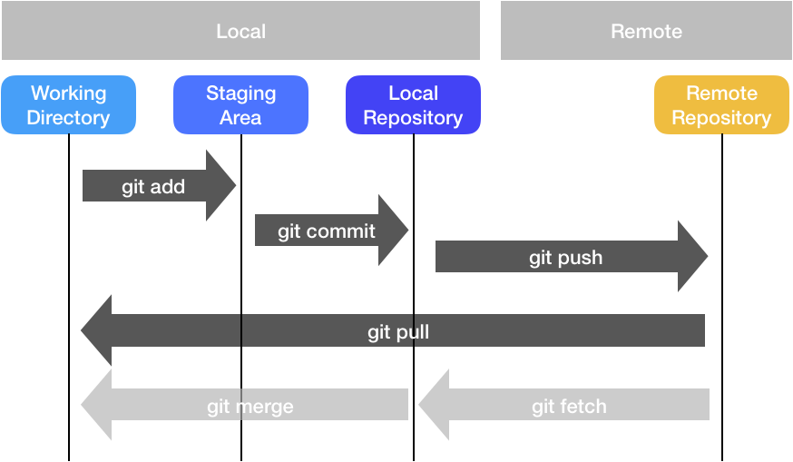
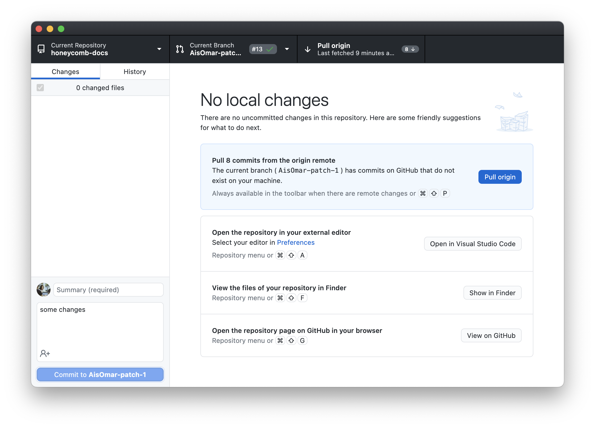
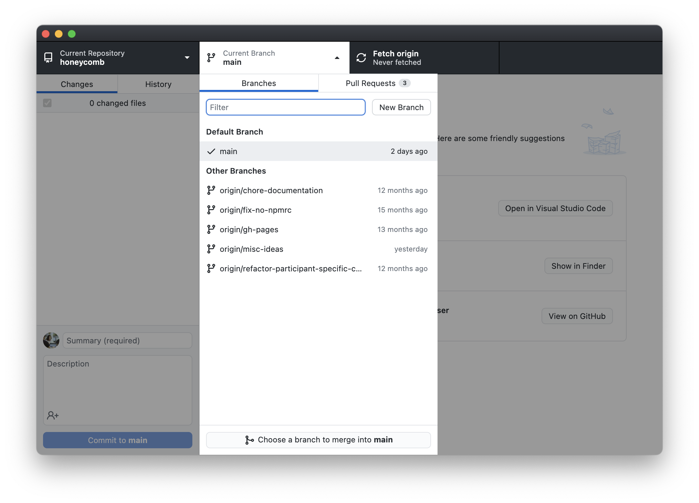
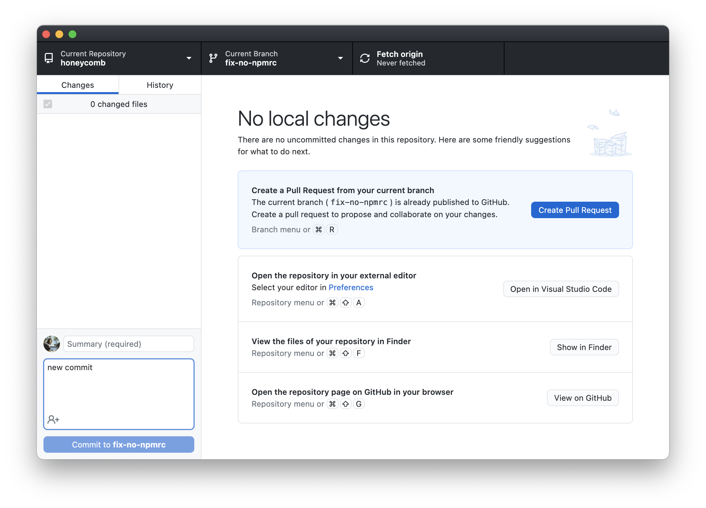

## Git Overview

Git is a version control system that enables you to track changes to files. With Git, you are able to revert files back to previous versions, restore deleted files, remove added files and even track down where a particular line of code was introduced.

Git creates a hidden `.git` folder \(in the current folder\) to store the details of the file system - this folder contains all the data required to track your files and is known as a **repository**, or repo.

Git tracks file changes by the user creating a _save point_, or in Git terms a **commit**. Each commit takes a snapshot of the current file system. Commits are uniquely identified by a SHA–1 hash. This is a 40 character string which may along the lines of `ded7a0db6422d59e9893e975e32275fc36f853da`This hash can be used to track a particular commit within the repository.

Nearly all operations that are performed by Git are in you local computing environment, for the exception of few used purely to synchronize with a remote. Some of the most common git operations are depicted below. In summary, a typical flow consists of making changes to your files, _staging_ them via `git add`, marking a save point via `git commit`, then finally syncing to your remote \(e.g., GitHub\) via `git push`. If you are pushing changes to your remote from multiple places, you can bring changes your most recent version using `git pull`, which is the equivalent of doing `git fetch` followed by a `git merge` operation



## Cheatsheet

| Command                       | Brief                                                              |
| :---------------------------- | :----------------------------------------------------------------- |
| git add <files>         | add a file to next commit \(stage\)                                |
| git commit -m <message> | commit staged files                                                |
| git push                      | upload staged commit to repo                                       |
| git pull                      | get remote repo commits and download \(try and resolve conflicts\) |
| git clone <url>         | download entire repository                                         |
| git branch <new-branch> | create a new branch on your currently checked out (HEAD) branch    |
| git checkout <branch>   | checkout the branch you want to use                                | 
  
  
```bash
# check status of your git repo including what's changed
git branch my_branch
# and what's not being tracked
git status
# add file contents to be ready to be committed
git add FILE 
# commit file contents to the local repository
git commit FILE
# commit all added/modified/deleted file contents with
# specific message
git commit -a -m "commit message"
# push file contents to the remote (i.e. cloud) repository
git push 
```

## Best Practices

### Workflow

We recommend a simple flow based on following rules:

* Use topic/feature branches, no direct commits on main.
* Perform tests and code reviews before merges into main, not afterwards.
* Everyone starts from main, and targets main.
* Commit messages reflect intent.

### Branches

* main is the default branch and where releases are made off. This branch should be in clean/working conditions at all times. This branch is protected and can only be merged from Pull Requests for topic branches
* topic branches are created for new features, fixes, or really any changes

### Comment styles

We encourage using [Commitizen](http://commitizen.github.io/cz-cli/), a great tool for writing angular commits - this will create a standardized commit format which makes for easier change logging and more sane messages.
  
### Alternative options 
  
Instead of using commands in the terminal, you can also download [GitHub desktop](https://desktop.github.com/). It is very intuitive to use. 
  
#### Clone repository 


  
#### Select a branch or create a new branch


  
#### Commit changes and push



  
