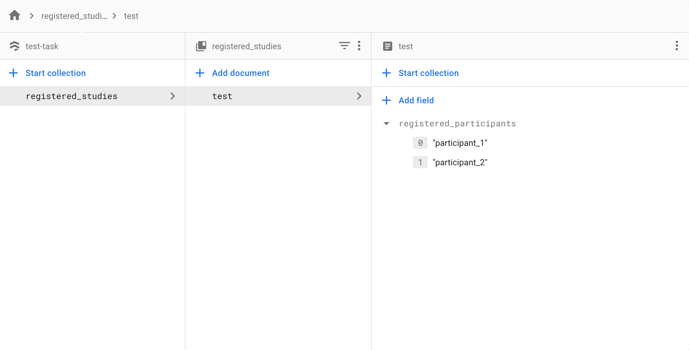

Honeycomb comes with methods and configurations for easy [Firebase](https://firebase.google.com/) and [Cloud Firestore](https://firebase.google.com/docs/firestore) set up. Please use this section to configure [Firebase Hosting](https://firebase.google.com/docs/hosting) services and firestore cloud storage.

## Getting Started

Follow these steps to create a firebase project and link it with the current task.

#### 1. Initializing firebase account and project
- Create and login to a firebase account on [the Firebase website](https://firebase.google.com/).
- Create a firebase project by clicking add project and enter a Project Name.

#### 2. Linking firebase to task
- Install [Firebase CLI](https://firebase.google.com/docs/cli) on your local computer.
- Login to firebase using `firebase login` command in the terminal.
- Navigate to the `.firebaserc` file home directory and edit the `"default"` field with the project name given in part 1.
    ```
    {
        "projects": {
            "default": "<your project name>"
        }
    }   
    ``` 
#### 3. Copying web app credentials.
- Navigate to the [firebase console](https://console.firebase.google.com/) and select the project.
- Click `Add App` and choose to create a wep app. Enter app name and click `Register App`.
- Copy these fields in the firebase SDK generated from the console to the corresponding variable in the `.env.firebase` file in the `env` folder:
  ```
    REACT_APP_apiKey=
    REACT_APP_authDomain=
    REACT_APP_projectId=
    REACT_APP_storageBucket=
    REACT_APP_messagingSenderId=
    REACT_APP_appId=
  ```
Firebase is now set up!

## Setting up firestore.

Honeycomb includes cloud storage for task data using Firestore. Follow these steps to initialize firestore:

- Navigate to the current project in the developer console and select `Firestore Database` from the sidebar.
- Click `Create Database`, select `production mode` and choose the current location for the cloud storage bucket.
  
### Firestore security rules.

[Firestore Security Rules](https://firebase.google.com/docs/firestore/security/get-started) provides easy server-side authorization to the database. For a honeycomb task, we use the security rules to allow access to only authorized participants for a specified study. Honeycomb's default set of rules is included in the `firestore.rules` file in the home directory. This file can be edited to change the rules. To deploy the rules in the file, type the following line of code in the terminal:
```
firebase deploy --only firestore:rules
```
Alternatively, Editing the rules directly in the console is also possible. To do so, navigate to the `Rules` tab in the `Firestore Database` section from the firebase console sidebar then copy and paste the code that is in the `firestore.rules` file.

Firestore database and rules are now both deployed. For Honeycomb's default set of rules, to add an authorized participant for a study, create a collection named `registered_studies`, add a study with the study ID as the document name in that collection. For each registered study, add an array field named `registered_participants` where each element in the array will be an authorized participant for that study.

